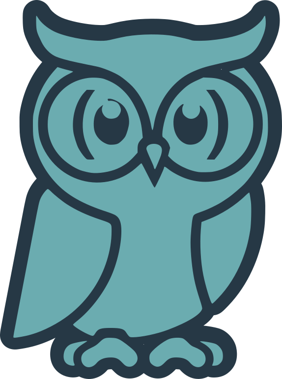

# Zyl Branding Guidelines

**Version 1.0** — Last updated: September 2026

## Core Identity
- **Name**: Zyl
- **Tagline**: "Deterministic Power. Expressive Safety."
- **Secondary Tagline**: "Hygienic, Homoiconic, Hardened"
- **Mascot**: **Parry the Owl** — A simple, friendly cartoon owl representing wisdom, precision, and Lisp parentheses.

## Logo
- **Primary Logo**: Stylized "Z" between balanced Lisp parentheses `()`, with the "Zyl" wordmark below.
- **Color Version**: Teal-green to blue gradient on the "Z" (roughly #41E5B7 to #22B8CC in the artwork), with dark teal-to-navy parentheses and dark outlines.
- **Monotone / B&W**: A high-contrast black version for print is intended, but not yet among the assets.
- **Minimum Size**: 100px wide for digital use.
- **Clear Space**: Maintain padding equal to 1/4 the logo height around all sides.

**Do's**:
- Use official assets only.
- Pair with tagline when space allows.
- Use on dark backgrounds for the color version.

**Don'ts**:
- Distort, stretch, or recolor the logo.
- Add effects or shadows unless approved.
- Use the mascot overlapping the logo without proper spacing.

## Mascot: Parry the Owl
</img>
- Simple cartoon owl with Lisp `()` accents.
- Use for fun illustrations, error pages, stickers, or social posts.
- Keep consistent teal/blue palette.

**Approved Uses**:
- GitHub README hero.
- Conference slides.
- Merch (stickers, t-shirts).

## Color Palette
- **Primary Teal**: RGB(0, 180, 166) | Hex #00B4A6
- **Navy Accent**: RGB(10, 37, 64) | Hex #0A2540
- **Light Teal**: RGB(173, 232, 222) | Hex #ADE8DE
- **Neutral Dark**: RGB(15, 23, 42) | Hex #0F172A
- **White/Off-white** for text on dark backgrounds.

The palette above is the guideline for new material; the logo artwork
predates it and uses its own gradient values (see Logo).

## Typography
- **Headings**: Bold sans-serif (e.g., Inter or system sans).
- **Body/Code**: Monospace (e.g., JetBrains Mono).

## Acceptable Use
This branding is for promoting the Zyl programming language. Commercial use (e.g., merchandise) is allowed with attribution. Contact the maintainer for high-res assets or custom approvals.

The `assets/` folder holds:

- `logo.svg` — the mark with the wordmark (vector)
- `logo.png` — the same, 559×641 raster; used as the README header
- `logo-only.svg` — the mark without the wordmark (vector)
- `parry.svg` — Parry the Owl (vector)

---

*Questions? Open an issue on the repo.*
